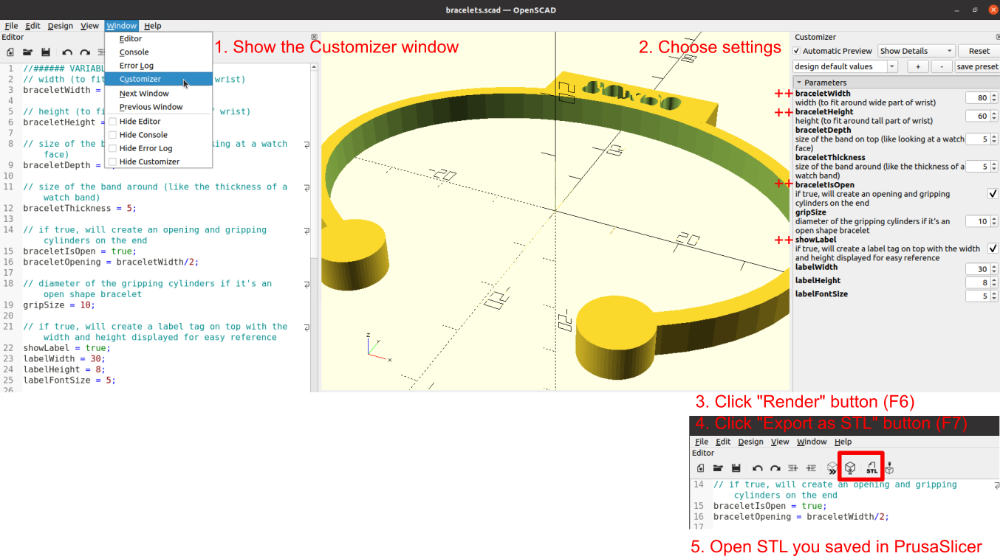
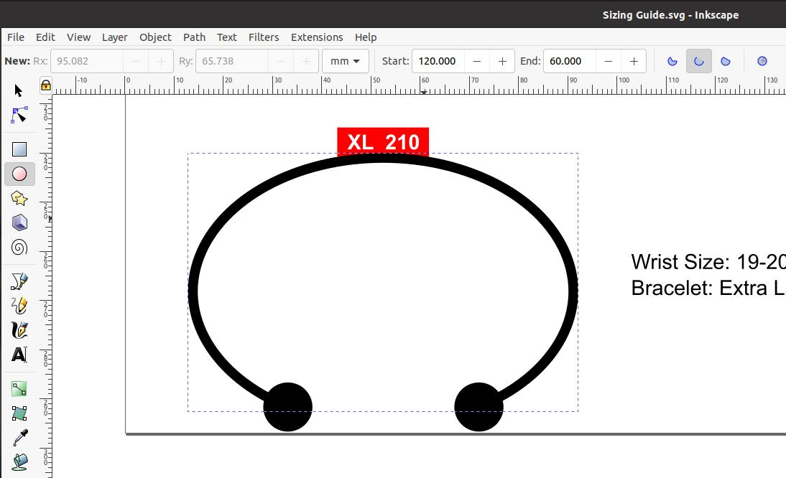

# Bracelet Sizing Set

These are for determining your bracelet size (kind of like trying on different rings to determine your size). I used [Pandora's Sizing Guide](https://us.pandora.net/en/size-guide/bracelets.html) as a starting point for the models.

## Pre-Sized Downloads (OPEN design = opening at bottom for wrist)
- **Small**: 60mm width x 40 height
  - [Small STL](stls/bracelet_open_S.stl) || [Small SVG](svgs/bracelet_open_S.svg)
- **Medium**: 67mm width x 50 height
  - [Medium STL](stls/bracelet_open_M.stl) || [Medium SVG](svgs/bracelet_open_M.svg)
- **Large**: 74mm width x 55 height
  - [Large STL](stls/bracelet_open_L.stl) || [Large SVG](svgs/bracelet_open_L.svg)
- **Extra Large**: 80mm width x 60 height
  - [Extra Large STL](stls/bracelet_open_XL.stl) || [Extra Large SVG](svgs/bracelet_open_XL.svg)

## Pre-Sized Downloads (CLOSED design = fully-enclosed oval)
- **Small**: 73mm width x 55mm height
  - [Small STL](stls/bracelet_closed_S.stl) || [Small SVG](svgs/bracelet_closed_S.svg)
- **Medium**: 80mm width x 60mm height
  - [Medium STL](stls/bracelet_closed_M.stl) || [Medium SVG](svgs/bracelet_closed_M.svg)
- **Large**: 88mm width x 66mm height
  - [Large STL](stls/bracelet_closed_L.stl) || [Large SVG](svgs/bracelet_closed_L.svg)
- **Extra Large**: 95mm width x 71mm height
  - [Extra Large STL](stls/bracelet_closed_XL.stl) || [Extra Large SVG](svgs/bracelet_closed_XL.svg)

## How to Customize
1. Download and install [OpenSCAD](https://openscad.org/downloads.html)
2. Open [bracelets.scad](bracelets.scad) in the OpenSCAD editor
3. Open the Customizer window if it's not already visible
4. Choose your settings in the Customizer
    - Common sizes
      - Small: 60mm width x 40 height
      - Medium: 67mm width x 50 height
      - Large: 74mm width x 55 height
      - Extra Large: 80mm width x 60 height
    - Common settings to change in Customizer
      - braceletWidth
      - braceletHeight
      - braceletIsOpen
      - showLabel
5. Render (F6) and Export to STL (F7) in OpenSCAD to save the file
6. Open the STL in PrusaSlicer (or your slicer of choice) and print!
    - Infill: 15%
    - Supports: None
    - Brim: No
    - Time: About 25 minutes on a Prusa MINI

## Usign OpenSCAD

## Notes about the Design
I used [Inkscape](https://inkscape.org) to iterate on the design at first, and then I switched it into a customizable OpenSCAD file once the design was finalized.

In [Inkscape](https://inkscape.org), I set the ellipse width and height. Then I chose how large of an opening I wanted to use by changing the Start and End of the ellipse (in degrees).

I compared the resulting sizes to the bracelet circumferences listed on [Pandora's Sizing Guide](https://us.pandora.net/en/size-guide/bracelets.html). Since the circumference of a generic ellipse can be a bit wonky (and I'm lazy), I used [this website to calculate my ellipse circumferences](https://miniwebtool.com/ellipse-circumference-calculator) to compare with Pandora.

To convert my draft Inkscape files into 3D-printable STLs, I saved the individual sizes into their own SVG files in Inkscape. Then I converted them using Path >> Stroke to Path in Inkscape. Then I used a [simple OpenSCAD script](design/SVG%20to%20STL.scad) to turn those flat designs into 3D files.